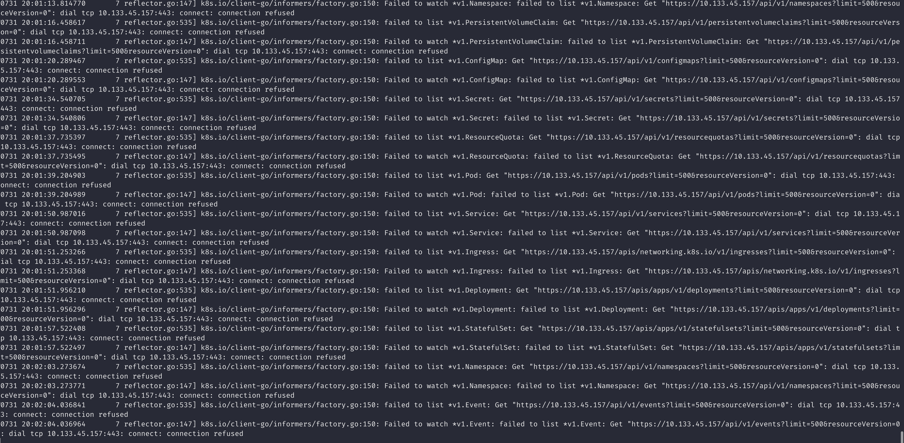

# Kubernetes Informer WaitForCacheSync 引起的死锁

## 背景

最近基于 loft-sh/vcluster 开发虚拟 K8s 集群管理项目，采用整洁架构，层与层之间的调用是严格从上往下调用的，对 MySQL 和
Kubernetes
的操作都放在了 DataSource 层中，所以下面分析问题时只需要关注 DataSource 层即可。

需求是这样的，我编写的项目在微服务中扮演一个 虚拟集群的 "Gateway" 角色，它可以向外提供一些基础的
API，例如创建/暂停/恢复/删除/查询虚拟集群等等。

比如说有这样的一个 API：返回虚拟集群中所有的 Pod 列表，这时候就要使用 ClientSet 去连接到虚拟集群，然后进行一次 List
操作。

考虑到查询操作还是很频繁的，而且还要查询其他资源，比如 ConfigMap、Secret、Deployment 等等。因此我做了两点优化：

* 使用 SharedInformer 去监听虚拟集群的 Pod 变化（当然也包括其他K8s 原生资源），每次从缓存中获取 Pod 列表。
* 保存虚拟集群的 ClientSet 和 InformerFactory，避免每次都创建，并且采用延迟初始化，只有当请求进来时才去创建。

## 代码实现

从下面代码可以看到，使用一个并发不安全的 map 来保存 Manager 对象，它里面有 ClientSet 和 InformerFactory。
并且使用了 sync.RWMutex 来保证并发安全。

~~~

type ClusterName = string

const (
	DefaultCluster ClusterName = "inCluster"
	// ResyncPeriod is the resync period for the shared informer factory
	ResyncPeriod = time.Second * 30
)

type KubeClientManager struct {
	ClientSet       *kubernetes.Clientset
	InformerFactory informers.SharedInformerFactory
}

type KubernetesDataSource struct {
	// 底层 K8s 集群使用的 stopCh
	StopCh chan struct{}

	sync.RWMutex
	ClientSets   map[ClusterName]*KubeClientManager
}
~~~

当对 k8s 的做任何操作时，都需要先获取一个 KubeClientManager 对象，理所当然的我提供了一个 GetClientManager 方法，如下：

~~~
func (kds *KubernetesDataSource) GetClientManager(name ClusterName) (*KubeClientManager, error) {
	kds.RLock()
	clientManager, exists := kds.ClientSets[name]
	kds.RUnlock()

	if exists {
		return clientManager, nil
	}

	if name == DefaultCluster {
		return nil, errors.Errorf("clusterId %s not found", name)
	}

	kds.Lock()
	defer kds.Unlock()

	// Double-check if another goroutine has already created the clientManager
	clientManager, exists = kds.ClientSets[name]
	if exists {
		return clientManager, nil
	}

	// generate vcluster clientSet
	vcClientSet, err := kds.generateVClusterClientSet(name)
	if err != nil {
		return nil, errors.Wrap(err, "failed to generate vcluster clientSet")
	}

	// create KubeClientManager and start informer
	manager := newVClusterKubeClientManager(vcClientSet)
	
	
	kds.ClientSets[name] = manager

	vcStopCh := make(chan struct{})
	manager.InformerFactory.Start(vcStopCh)
	manager.InformerFactory.WaitForCacheSync(vcStopCh)

	return manager, nil
}
~~~

我来稍微解释一下这个方法的实现：

* 首先使用读锁去 map 中查询 ClientManager 对象，如果存在则直接返回。
* 如果不存在并且获取的是底层 k8s 集群的 ClientManager 对象，说明 map 中数据有误，直接返回错误。
* 然后就是初始化一个虚拟集群的 ClientManager 对象，这时候需要加写锁，将对象填写到 map 中，并且启动 Informer。

## 遇到的问题

乍一看好像没有问题，因为两次加锁操作都有对应的释放操作，并且函数中调用的 `generateVClusterClientSet`
和 `newVClusterKubeClientManager` 都是无锁的。

但是某天深夜遇到了一个 bug，当点击已经暂停的虚拟集群时，会一直 loading，这倒不是致命的，致命的是创建虚拟集群的接口也不能使用，所有关于
k8s 的操作都会被阻塞。

> 这里有必要解释一下我们的暂停/Pause 接口的实现：将虚拟集群的控制面 Deployment/StatefulSet 的 replicas 设置为 0。只是停止
> pod，service、secret、configmap 等资源不会被删除。

当时的 hotfix 是我们对虚拟集群，也就是 vcluster 进行 get/list 操作时，会先判断它的状态，如果是 paused 状态则直接返回，不让它走到
k8s 这一层。
当然这完美的解决了问题，并且一个月后，项目迭代，我的项目砍掉了获取 k8s 资源的接口，bug 自然也被修复了。

## 解决

由于很明显是死锁问题，这一段时间工作清闲了，我重新读了一遍 [《Go 并发编程实战课》](https://time.geekbang.org/column/intro/355)
中关于 Mutex 的内容，我更加确定了锁的使用是没有任何问题的，并且还很乖巧的使用了 defer 来释放锁。

所以我开始写 demo 测试，并模拟场景。下面我为你描述一下这个场景：
首先通过我们的 API 创建了一个虚拟 k8s 集群，并且启动成功，对应到代码中的 DataSource 层就是我们把一个 Manager 对象存在 map
中。

然后我们 Pause 了它，所以它的 ApiServer Pod 会被删除，但是 service、secret 等其他资源还是存在的。
还是存在的。
> 我们创建 vcluster 集群的 ClientSet 信息可以来自它所在的 Namespace 中的 secret 和 service，如果对这个感兴趣，可以去了解一下
> vcluster

当获取集群中的 pod 列表请求打到时，informer 会把之前的缓存返回，这没问题，最多informer 报些错误，不至于阻塞全部 k8s 操作。

但是当服务重启时，map 中已经没有这个虚拟集群的 Manager 对象了，当获取 虚拟集群 pod 列表请求打到 DataSource 层时，会去创建一个新的
Manager
对象，ClientSet 和 Informer 如期被创建，并且Start Informer 时， K8s 会新启动携程去执行，不会阻塞当前携程，如下：

~~~
func (f *sharedInformerFactory) Start(stopCh <-chan struct{}) {
	f.lock.Lock()
	defer f.lock.Unlock()

	if f.shuttingDown {
		return
	}

	for informerType, informer := range f.informers {
		if !f.startedInformers[informerType] {
			f.wg.Add(1)
			// We need a new variable in each loop iteration,
			// otherwise the goroutine would use the loop variable
			// and that keeps changing.
			informer := informer
			go func() {
				defer f.wg.Done()
				informer.Run(stopCh)
			}()
			f.startedInformers[informerType] = true
		}
	}
}
~~~

关键就在于 WaitForCacheSync，它会一直等待缓存同步，并且它使用的 stopCh 是我们随意初始化的，
并且没编写超时 close 的逻辑。

这就导致了请求会一直持有写锁，又因为这个集群因为被
Pause 了，无法和 ApiServer 同步，导致了 GetManager 方法不可用，恰到所有操作 K8s 资源的口子又在这里。

解决方法很简单，单独使用一个 channel 去等待 Informer 的 cache 同步。

~~~
	timeout := 5 * time.Second
	ctx, cancel := context.WithTimeout(context.Background(), timeout)
	defer cancel()

	curStopCh := make(chan struct{})
	go func() {
		<-ctx.Done()
		close(curStopCh)
	}()

	klog.Infof("begin to wait cache sync")
	
	if ok := cache.WaitForCacheSync(curStopCh, informer.HasSynced); !ok {
		klog.Fatalf("failed to wait for caches to sync")
	}
	
	klog.Infof("cache synced")
~~~

最后来一张当时的报错...

## 总结

整个问题的排查过程其实是非常复杂的，当时遇到这个问题已经是下班时间了，并且项目马上要提测上线，加上让加班解决问题，根本来不及思考问题出在哪里，
只能写一些 hard coding，来完成工作。

并且我通过 demo 排查时，并不是重新跑之前的项目，而且直接在一个空白的项目编写测试用例，我也很推荐你这样去做。这需要先手工的删去一些不相关的代码。

其次就是场景的模拟，我最开始的猜测是 Informer 监听的资源不存在时，它会一直重试，阻塞了整个程序，因为报错信息都是指向了
Informer。
所以我至少做了以下场景的模拟：

* 创建 ClientSet 并启动 Informer，监听一些资源。删除掉整个 K8s 集群，观察 Informer 的行为。
* 创建 ClientSet 并启动 Informer，删除掉 ApiServer 的 Pod，观察 Informer 的行为。

最后的最后我还是想说，人就应该闲点，这个 bug 出现了已经一个月，这几个月我忙的不可开交，根据没时间去回顾这个。甚至因为涉及到的知识很多，我都懒得去再次学习。

下面附上我测试的 demo 代码：
~~~
package main

import (
	"context"
	"fmt"
	"k8s.io/apimachinery/pkg/labels"
	"k8s.io/apimachinery/pkg/util/runtime"
	"k8s.io/client-go/informers"
	"k8s.io/client-go/kubernetes"
	"k8s.io/client-go/tools/cache"
	"k8s.io/client-go/tools/clientcmd"
	"k8s.io/klog/v2"
	"log"
	"sync"
	"time"
)

func main() {
	config, err := clientcmd.BuildConfigFromFlags("", "./kubeconfig.yaml")
	if err != nil {
		log.Fatal(err)
	}

	// create the clientset
	clientset, err := kubernetes.NewForConfig(config)
	if err != nil {
		log.Fatal(err)
	}

	stopper := make(chan struct{})
	defer close(stopper)

	// 初始化 informer
	factory := informers.NewSharedInformerFactory(clientset, 0)
	nodeInformer := factory.Core().V1().Pods()
	informer := nodeInformer.Informer()
	defer runtime.HandleCrash()

	// 启动 informer，list & watch
	go factory.Start(stopper)

	timeout := 5 * time.Second
	ctx, cancel := context.WithTimeout(context.Background(), timeout)
	defer cancel()

	curStopCh := make(chan struct{})
	go func() {
		<-ctx.Done()
		close(curStopCh)
	}()

	klog.Infof("begin to wait cache sync")
	if ok := cache.WaitForCacheSync(curStopCh, informer.HasSynced); !ok {
		klog.Fatalf("failed to wait for caches to sync")
	}

	fmt.Println("开始WaitForCacheSync....")
	// 从 apiserver 同步资源，即 list
	//if !cache.WaitForCacheSync(stopper, informer.HasSynced) {
	//	runtime.HandleError(fmt.Errorf("Timed out waiting for caches to sync"))
	//	return
	//}
	fmt.Println("WaitForCacheSync完成....")

	informer.AddEventHandler(cache.ResourceEventHandlerFuncs{
		AddFunc: func(obj interface{}) {
			fmt.Println("add node")
		},
		UpdateFunc: func(interface{}, interface{}) { fmt.Println("update not implemented") }, // 此处省略 workqueue 的使用
		DeleteFunc: func(interface{}) { fmt.Println("delete not implemented") },
	})

	var lock sync.Mutex
	var times int
	for {
		time.Sleep(1 * time.Second)
		go func() {
			logPrefix := fmt.Sprintf("当前的 times 是: %d", times)
			fmt.Println(logPrefix, "准备获取锁")

			lock.Lock()
			pods, err := factory.Core().V1().Pods().Lister().Pods("").List(labels.Everything())
			if err != nil {
				lock.Unlock()
				fmt.Println(logPrefix, "错误：", err.Error())
			}
			lock.Unlock()

			fmt.Println(logPrefix, "pods len: ", len(pods))
		}()
		times++
	}
}

~~~